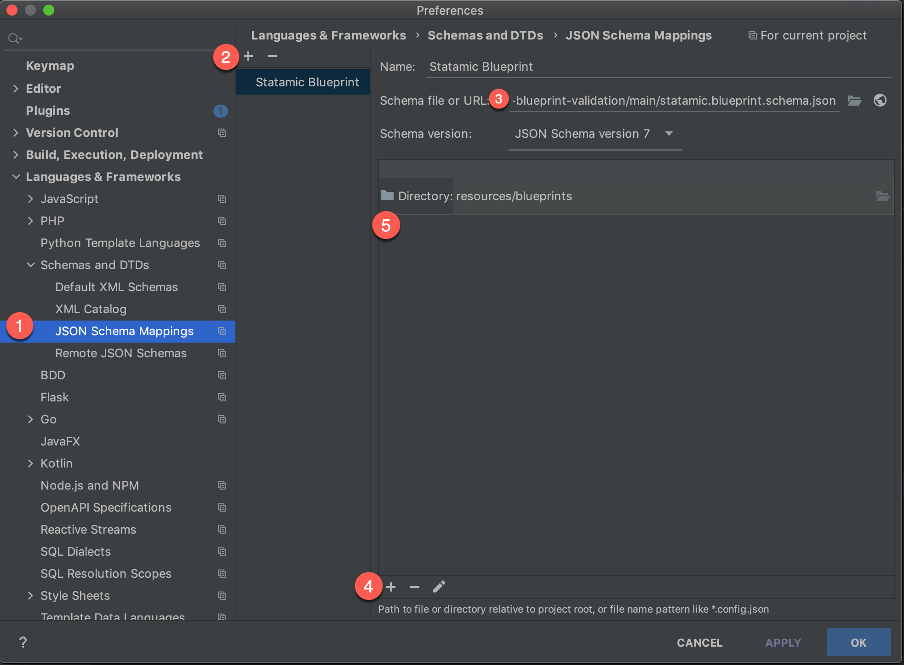

# Autocompletion and validation of [Statamics](https://statamic.com/) Blueprint YAML configuration

## Introduction

The schema supports all fieldtypes, their options and the validation rules.  

## Setup

### PhpStorm | IntelliJ

1. Open PhpStorm and switch to *File > Preferences > Languages & Frameworks > Schemas and DTDs > JSON Schema Mappings*
2. Add a new entry with the following options
   - **Schema file or URL**: `https://raw.githubusercontent.com/Konafets/statamic-blueprint-validation/main/statamic.blueprint.schema.json`
   - **Directory**: `resources/blueprints`

## Credits

* Thanks [Jonas](https://github.com/jonassiewertsen) for providing a test blueprint
